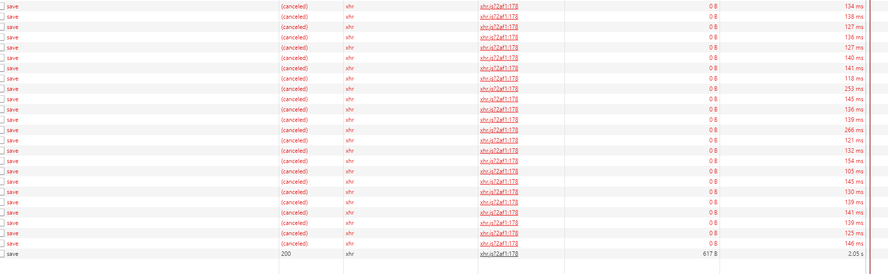

### 一键解决重复提交问题，妈妈再也不用担心我忘记写防止表单重复提交的功能了

前天看到了axios有取消请求的钩子函数，想到了可以做防止重复提交的功能，然后问度娘，果然已经有这方面的内容了，于是...嘿嘿嘿。

本文是基于网上文章以及fd-cli的axios配置综合而成。

<!-- more-->

#### 一、原理

+ axios提供CancelToken，用来取消请求
+ 通过请求地址&请求方式拼接来判断是不是重复请求（可根据需求自定义）

#### 二、效果

#### 三、注意事项

+ 此取消效果图是我在模拟网络环境3G的时候截取的，在网络好的时候，仍然会多次提交，是因为手速没有那么快（可防抖处理）

#### 四、源码

以下为我在项目中使用fd-cli用的axios配置，其中有些登录相关内容，不需要可以自定义：

~~~javascript
import ajax from 'axios';
import Vue from 'vue';
import Qs from 'qs';

const NUM_401 = 401;
const NUM_500 = 500;
// 声明一个map用于存储每个ajax请求的取消函数和ajax标识
const pending = new Map();
const CancelToken = ajax.CancelToken;
// 生成请求秘钥
const generateReqKey = (config) => {
    if (!config) {
        return;
    }
    const {
        method, url, params, data
    } = config;
    return [method, url, Qs.stringify(params), Qs.stringify(data)].join('&');
};
// 添加
const addPending = (config) => {
    if (!config) {
        return;
    }
    const requestKey = generateReqKey(config);
    config.cancelToken = config.cancelToken || new CancelToken((cancel) => {
        if (!pending.has(requestKey)) {
            pending.set(requestKey, cancel);
        }
    });
};
// 移除
const removePending = (config) => {
    const requestKey = generateReqKey(config);
    if (pending.has(requestKey)) {
        const cancelToken = pending.get(requestKey);
        cancelToken(requestKey);
        pending.delete(requestKey);
    }
};

// 开始
ajax.globalBefore = function (config) {
    // 在一个ajax发送前执行一下取消操作
    removePending(config);
    addPending(config);
    // ajax 开始加载
    Vue.prototype.$AjaxLoading.start(config);
    // 开始加载
    window.postMessage(JSON.stringify({cmd: 'loading-start'}), '*');
};
// 结束
ajax.globalAfter = function (response) {
    removePending(response.config || {});
    if (pending.length === 0) {
        // ajax 加载结束
        Vue.prototype.$AjaxLoading.finish();
        // 开始加载
        window.postMessage(JSON.stringify({cmd: 'loading-finish'}), '*');
    }
};
// 判断请求返回的状态值
ajax.judgmentResponse = function (response) {
    // http status为401
    if (response && response.status === NUM_401) {
        window.location = window.fdConfig.url.login + encodeURIComponent(window.location);
    }
    // http status为500
    if (response && response.status === NUM_500) {
        const responseData = response.data;
        if (responseData && responseData.data) {
            if (typeof responseData.data !== 'undefined' && responseData.data.gw_code === NUM_401) {
                window.location = window.fdConfig.url.login + encodeURIComponent(window.location);
            } else {
                this.$Message.error(responseData.message);
            }
        }
    }
};
// 前置拦截器
ajax.interceptors.request.use(function (config) {
    const _config = config || {};
    _config.headers = _config.headers || {};
    _config.headers['X-Requested-With'] = 'XMLHttpRequest';
    // 如果启用全局事件
    if (!_config.forbidGlobal) {
        // 执行全局函数
        ajax.globalBefore(config);
    }
    // 前置函数
    if (typeof _config.before === 'function') {
        _config.before();
    }
    return _config;
}, function (error) {
    // 对请求错误做些什么
    return Promise.reject(error);
});
// 后置拦截器
ajax.interceptors.response.use(function (response) {
    if (!response.config.forbidGlobal) {
        // 执行全局函数
        ajax.globalAfter(response);
    }
    // 后置函数
    if (typeof response.config.after === 'function') {
        response.config.after();
    }
    // 判断请求返回的状态值
    ajax.judgmentResponse(response);
    // 对响应数据做点什么
    return response;
}, function (error) {
    if (error.config && !error.config.forbidGlobal) {
        // 执行全局函数
        ajax.globalAfter(error);
    }
    if (error && error.response) {
        // 判断请求返回的状态值
        ajax.judgmentResponse(error.response);
    }
    // 对响应错误做点什么
    return Promise.reject(error);
});

export default ajax;
~~~

