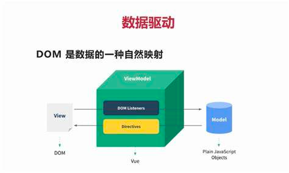

# 理解Vue的设计思想 MVVM
将视图View的状态和行为抽象化，让我们将视图UI和业务逻辑分开。


MVVM的三要素：数据响应式、模板引擎、渲染
数据响应式：监听数据变化并在视图中更新
+ Object.defineProperty()
+ Proxy

模板引擎：提供描述视图的模板引擎
+ 插值表达式：{{}}
+ 指令：v-bind、v-on、v-model、v-for、v-if...

渲染：将模板转换成html
+ 模板 => vDom => dom

## 数据响应式原理
数据变更能否响应在视图中，就是数据响应式。
利用`Object.defineProperty()`实现变更检测。 

```js
// reactive.js
function defineReactive(obj, key, val) {
  observe(val);
  Object.defineProperty(obj, key, {
    get() {
      console.log('get', key);
      return val;
    },
    set(v) {
      if (v !== val) {
        val = v;
        observe(v);
        console.log('set', key, val);
        // update(val);
      }
    },

  })
}

// 数组响应式
// 1.替换数组原型的7个方法
const rawProto = Array.prototype;
// 备份，修改备份
const arrayProto = Object.create(rawProto);
['push', 'pop', 'shift', 'unshift', 'sort', 'reverse', 'splice'].forEach(method => {
  arrayProto[method] = function () {
    // 原始操作
    rawProto[method].apply(this, arguments);
    // 覆盖
    console.log('覆盖' + method + '操作');
    observe(...arguments);
  }
});

function set(obj, key, val) {
  defineReactive(obj, key, val);
}

function observe(obj) {
  if (typeof obj !== 'object' || obj === null) {
    return obj;
  }
  if (Array.isArray(obj)) {
    // 覆盖原型，替换7个变更操作
    obj.__proto__ = arrayProto;
    for(let i = 0; i < obj.length; i++) {
      observe(obj[i]);
    }
  } else {
    // 对象
    Object.keys(obj).forEach(key => defineReactive(obj, key, obj[key]));
  }
}

const obj = {
  foo: 'foo',
  bar: 'bar',
  baz: {
    a: 1
  },
  arr: [1, 2, 3],
};
// 对obj进行响应式处理
observe(obj);
// defineReactive(obj, 'foo', ' foooooo');
obj.foo; // get
obj.foo = '111'; // set
obj.bar; // get
obj.bar = '222'; // set
obj.baz; // get
obj.baz.a = 'aaa'; // set
obj.baz = {
  a: 10
}
obj.baz.a = '10aaa';
obj.doo = 'doo';
obj.doo;
set(obj, 'doo', 'doo');
obj.doo = 'doo1';
obj.doo;

// 数组  重写数组的7个方法实现拦截  push pop shift unshift sort splice reverse
obj.arr[0];
obj.arr[0] = 2;
const temp = {b: 1}
obj.arr.push(temp);
temp.b = 2;
```
数组使用索引访问和赋值可以被监听到，但是使用Array的方法操作数组就监听不到了。
要想实现监听，就需要重写数组的7个方法实现拦截。

简单实现将`js`中对象的`time`属性渲染到`html`。
```html
<div id="app"></div>
<script>
    // 首先引入上面的script代码，即reactive.js
    // 放开其中的Object.defineProperty 中set的update
    const app = document.querySelector('#app');
    function update(val) {
        app.innerText = val;
    }
    const obj = {time: 0};
    observe(obj);
    setInterval(() => {
        obj.time = new Date().toLocaleTimeString();
    }, 1000);
</script>
``` 

## vue中的数据响应式
原理分析：
1. `new Vue()`首先执行初始化，对data执行响应式处理，这个过程发生在Observer中
2. 同时对模板执行编译，找到其中动态绑定的数据，从data中获取并初始化视图，这个过程发生在Compile中
3. 同时定义一个更新函数和Watcher，将来对应数据变化时Watcher会调用更新函数
4. 由于data的某个key在一个视图中可能出现多次，所以每个key都需要一个管家Dep来管理多个watcher
5. 将来data中数据一旦发生变化，会首先找到对应的Dep，通知所有Watcher执行更新函数


### 涉及类型介绍
+ Kvue: 框架构造函数
+ Observer: 执行数据响应化（分辨数据是对象还是数组）
+ Compile: 编译模板，初始化视图，依赖收集（更新函数，watcher创建）
+ Watcher：执行更新函数（跟新dom)
+ Dep：管理多个watcher，批量更新

#### Kvue
框架构造函数：执行初始化 
执行初始化，对data执行响应化处理，主要是下面代码中的`proxy`
```js
function defineReactive(obj, key, val) {
  observe(val);
  // 创建一个dep实例
  const dep = new Dep();
  Object.defineProperty(obj, key, {
    get() {
      console.log('get', key);
      // 依赖收集
      Dep.target && dep.addDep(Dep.target);
      return val;
    },
    set(v) {
      if (v !== val) {
        val = v;
        observe(v);
        console.log('set', key, val);
        // update();
        dep.notify();
      }
    },

  })
}

function observe(obj) {
  if (typeof obj !== 'object' || obj === null) {
    return obj;
  }
  Object.keys(obj).forEach(key => defineReactive(obj, key, obj[key]));
}

function proxy(vm) {
  Object.keys(vm.$data).forEach(key => {
    Object.defineProperty(vm, key, {
      get() {
        return vm.$data[key];
      },
      set(val) {
        vm.$data[key] = val;
      }
    })
  })
}

class Kvue {
  constructor(options) {
    // 1.保存选项
    this.$options = options;
    this.$data = options.data;
    // 2.对data选项做响应式处理
    observe(this.$data);
    // 2.5代理
    proxy(this);
    // 3.编译
    new Compile(options.el, this);
  }
}
```

#### 编译 Compile
编译模板中Vue模板特殊语法，初始化视图、更新视图
编译dom->遍历子节点->编译节点（编译文本）->遍历属性(事件)->监听input、处理textContent、innerHtml、绑定click等
```js
class Compile {
  constructor(el, vm) {
    // 保存Kvue实例
    this.$vm = vm;
    // 编译模板树
    this.compile(document.querySelector(el));
  }

  // el模板根节点
  compile(el) {
    // 遍历el
    // 1.获取el所有子节点
    el.childNodes.forEach(node => {
      if (node.nodeType === 1) {
        // 元素
        // console.log('element', node.nodeName);
        this.compileElement(node);
        // 继续递归
        if (node.childNodes.length > 0) {
          this.compile(node);
        }
      } else if (this.isInter(node)) {
        // 插值文本
        // console.log('text', node.textContent);
        this.compileText(node);
      }
    })
  }

  update(node, exp, dir) {
    // 初始化
    const fn = this[`${dir}Update`];
    fn && fn(node, this.$vm[exp]);
    // 更新
    new Watcher(this.$vm, exp, function (val) {
      fn && fn(node, val);
    })
  }

  // 处理插值文本
  compileText(node) {
    this.update(node, RegExp.$1, 'text');
  }

  // 编译element
  compileElement(node) {
    // 1.获取当前元素的所有属性，并判断他们是不是动态属性
    const nodeAttr = node.attributes;
    Array.from(nodeAttr).forEach(attr => {
      const attrName = attr.name;
      const exp = attr.value;
      // 判断attrName是否有指令
      if (attrName.startsWith('k-')) {
        // 指令
        // 截取k-后面的部分，特殊处理
        const dir = attrName.substring(2);
        // 判断是否存在指令处理函数，若存在，则调用
        this[dir] && this[dir](node, exp);
      }
      // 判断attrName是否有事件
      if (attrName.startsWith('@')) {
        // @click="onclick"
        const dir = attrName.substring(1);
        // 事件监听
        this.eventHandler(node, exp, dir);
      }
    })
  }

  // k-text
  text(node, exp) {
    this.update(node, exp, 'text');
  }

  textUpdate(node, val) {
    node.textContent = val;
  }

  // k-html
  html(node, exp) {
    this.update(node, exp, 'html');
  }

  htmlUpdate(node, val) {
    node.innerHTML = val;
  }

  // k-model
  model(node, exp) {
    // update方法只完成赋值和更新
    this.update(node, exp, 'model');
    // 事件监听
    node.addEventListener('input', e => {
      this.$vm[exp] = e.target.value;
    })
  }

  modelUpdate(node, val) {
    node.value = val;
    node.value = val;
  }

  // {{xxxx}}
  isInter(node) {
    return node.nodeType === 3 && /\{\{(.*)\}\}/.test(node.textContent);
  }

  eventHandler(node, exp, dir) {
    const fn = this.$vm.$options.methods && this.$vm.$options.methods[exp];
    node.addEventListener(dir, fn.bind(this.$vm));
  }
}
```

#### 依赖收集
视图中会用到data中某key，这称为依赖。同一个key可能出现多次，每次都需要收集出来用一个watcher来维护它们，此过程称为依赖收集。
多个watch需要一个dep来管理，需要更新时由dep统一通知。
看下面案例，理出思路：
```js
 new Vue({
  template: `<div>
    <p>{{name1}}</p> 
    <p>{{name2}}</p> 
    <p>{{name1}}</p> 
  </div>`,
  data: {
    name1: 'name1',
    name2: 'name2',
  }
});
```
依赖（带动态数据的三个p）-> 收集 -> 变成三个watcher1/2/3 -> dep1(watcher1、watcher3) dep2(watcher2)
实现思路：
1. defineReactive时为每一个key创建一个Dep实例
2. 初始化视图时读取某个key，例如name1，创建一个watcher1
3. 由于触发name1的getter方法，便将watcher1添加到name1对应的dep中
4. 当name1更新，setter触发时，便可通过对应dep通知其管理所有watcher更新

 
#### Watcher
```js
// 负责具体更新任务的watcher
class Watcher {
  constructor(vm, key, updateFn) {
    this.$vm = vm;
    this.key = key;
    this.updateFn = updateFn;
    // 触发依赖收集
    Dep.target = this;
    vm[key];
    Dep.target = null;
  }

  update() {
    this.updateFn.call(this.$vm, this.$vm[this.key]);
  }
}
```

#### Dep
```js
// 和data中响应式的key之间是一一对应关系
class Dep {
  constructor() {
    this.deps = [];
  }

  addDep(dep) {
    this.deps.push(dep);
  }

  notify() {
    this.deps.forEach(dep => dep.update());
  }
}
```
