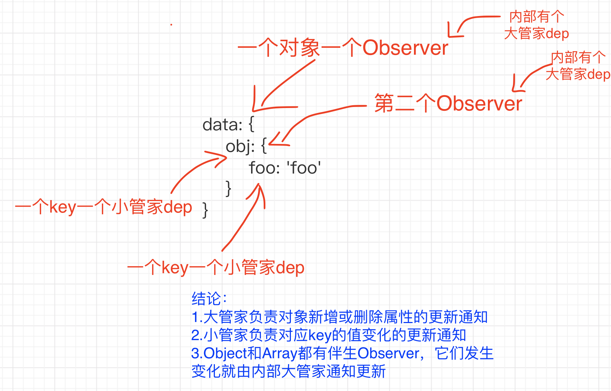

# 目标
+ vue初始化过程剖析
+ 深入理解数据响应式

[总结的思维导图](https://www.processon.com/mindmap/64d391ece55181435686cc5f)

## 文件结构
根目录：


源码目录：


术语解释：
+ runtime：仅包含运行时，不包含编译器
+ common：cjs规范，用于webpack1
+ esm：ES模块，用于webpack2+
+ umd: universal module definition，兼容cjs和amd，用于浏览器

## 入口
package.json中dev脚本中`-c scripts/config.js`指明配置文件所在
参数`TAGGET:web-full-dev`指明输出文件配置项
```js
{
  // Runtime+compiler development build (Browser)
  'web-full-dev': {
    entry: resolve('web/entry-runtime-with-compiler.js'), // 入口
    dest: resolve('dist/vue.js'), // 目标文件
    format: 'umd', // 输出规范
    env: 'development',
    alias: { he: './entity-decoder' },
    banner
  }
}
```

## 初始化流程
+ new Vue()
  + _init()
+ $mount()
  + mountComponent()
    + updateComponent()
      + render()
      + update()
    + new Watcher()


> [生命周期图示](https://v2.cn.vuejs.org/v2/guide/instance.html)

**入口 platforms/web/entry-runtime-with-compiler.js**

扩展默认$mount方法：处理template或el选项

**platforms/web/runtime/index.js**

安装web平台特有指令和组件
定义__patch__: 补丁函数，执行patching算法进行更新
定义$mount: 挂载vue实例到指定宿主元素（获得dom并替换宿主元素）

### new Vue()
**core/index.js**

初始化全局api
具体如下：
```js
Vue.set = set
Vue.delete = del
Vue.nextTick = nextTick
initUse(Vue) // 实现Vue.use函数
initMixin(Vue) // 实现Vue.mixin函数
initExtend(Vue) // 实现Vue.extend函数
initAssetRegisters(Vue) // 注册实现Vue.component/directive/filter
```

**core/instance/index.js**

Vue构造函数定义
定义Vue实例API
```js
function Vue (options) {
  // 构造函数仅执行了_init
  this._init(options)
}

initMixin(Vue) // 实现init函数
stateMixin(Vue) // 状态相关api $data,$props,$set,$delete,$watch
eventsMixin(Vue)// 事件相关api $on,$once,$off,$emit
lifecycleMixin(Vue) // 生命周期api _update,$forceUpdate,$destroy
renderMixin(Vue)// 渲染api _render,$nextTick
```

**core/instance/init.js**

创建组件实例，初始化其数据、属性、事件等
```js
initLifecycle(vm) // $parent,$root,$children,$refs
initEvents(vm) // 处理父组件传递的事件和回调 
initRender(vm) // $slots,$scopedSlots,_c,$createElement
callHook(vm, 'beforeCreate')
initInjections(vm) // 获取注入数据
initState(vm) // 初始化props，methods，data，computed，watch 
initProvide(vm) // 提供数据注入 callHook(vm, 'created')
```

### $mount
**mountComponent**

执行挂载，获取vdom并转换为dom

**new Watcher()**

创建组件渲染watcher

**update()**

初始化或更新，将传入vdom转换为dom，初始化时执行的是dom创建操作

**render() src\core\instance\render.js**

渲染组件，获取vdom

### 整体流程

new Vue() => _init() => $mount() => mountComponent() =>
new Watcher() => updateComponent() => render() => _update()

## 数据响应式

数据响应式是MVVM框架的一大特点，通过某种策略可以感知数据的变化。Vue中利用了JS语言特性
Object.defineProperty()，通过定义对象属性getter/setter拦截对属性的访问。

具体实现是在Vue初始化时，会调用initState，它会初始化data，props等，这里着重关注data初始
化，

### 整体流程

**initState (vm: Component) src\core\instance\state.js**
初始化数据，包括props、methods、data、computed和watch

**initData核心代码是将data数据响应化**
```js
function initData (vm: Component) {
  // 执行数据响应化
  observe(data, true /* asRootData */)
}
```

**core/observer/index.js**

observe方法返回一个Observer实例

**core/observer/index.js**

Observer对象根据数据类型执行对应的响应化操作

defineReactive定义对象属性的getter/setter，getter负责添加依赖，setter负责通知更新

**core/observer/dep.js**

Dep负责管理一组Watcher，包括watcher实例的增删及通知更新


### watcher
Watcher解析一个表达式并收集依赖，当数值变化时触发回调函数，常用于$watch API和指令中。

每个组件也会有对应的Watcher，数值变化会触发其update函数导致重新渲染
```js
export default class Watcher { 
  constructor () {}
  get () {}
  addDep (dep: Dep) {} 
  update () {}
}
```
> 相关API：$watch


### 数组响应化
数组数据变化的侦测跟对象不同，我们操作数组通常使用push、pop、splice等方法，此时没有办法得
知数据变化。所以vue中采取的策略是拦截这些方法并通知dep。

**src\core\observer\array.js**
为数组原型中的7个可以改变内容的方法定义拦截器

**Observer中覆盖数组原型**
```js
if (Array.isArray(value)) {
  // 替换数组原型
  protoAugment(value, arrayMethods) // value.__proto__ = arrayMethods
  this.observeArray(value)
}
```

