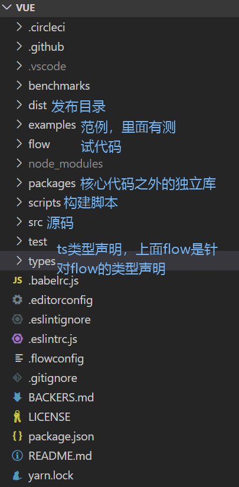
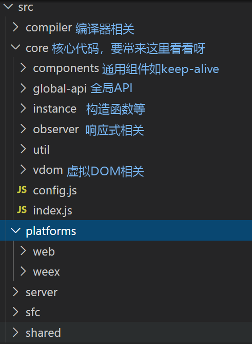

# 目标
+ vue初始化过程剖析
+ 深入理解数据响应式

## 文件结构
根目录：



源码目录：



术语解释：
+ runtime：仅包含运行时，不包含编译器
+ common：cjs规范，用于webpack1
+ esm：ES模块，用于webpack2+
+ umd: universal module definition，兼容cjs和amd，用于浏览器

## 入口
package.json中dev脚本中`-c scripts/config.js`指明配置文件所在
参数`TAGGET:web-full-dev`指明输出文件配置项
```js
{
  // Runtime+compiler development build (Browser)
  'web-full-dev': {
    entry: resolve('web/entry-runtime-with-compiler.js'), // 入口
    dest: resolve('dist/vue.js'), // 目标文件
    format: 'umd', // 输出规范
    env: 'development',
    alias: { he: './entity-decoder' },
    banner
  }
}
```


