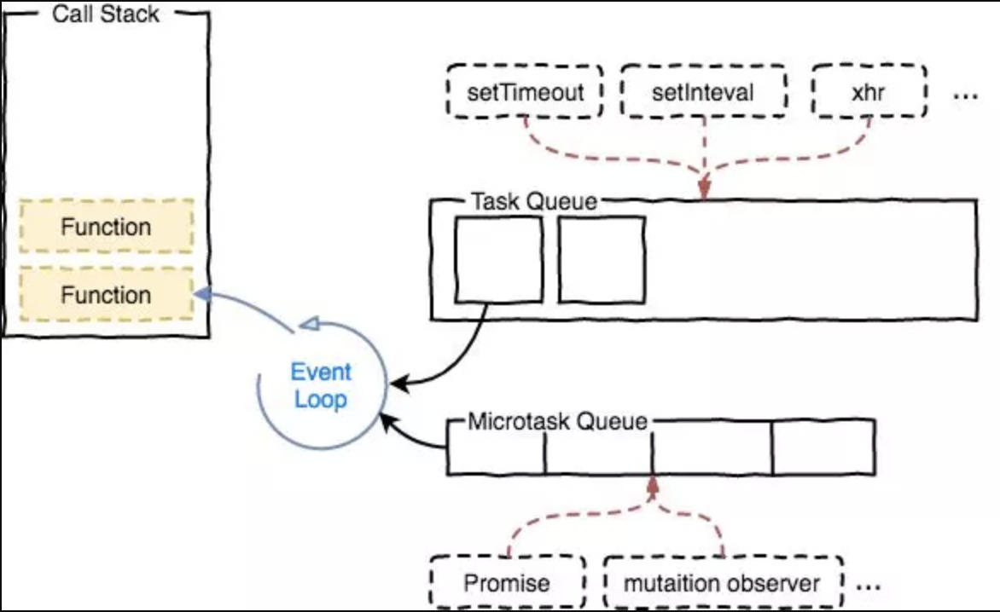
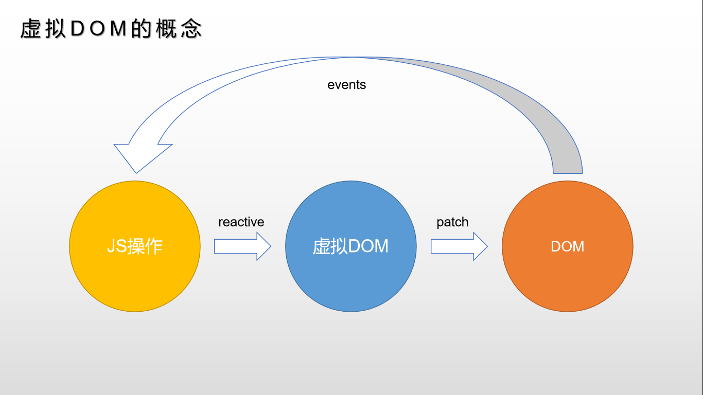
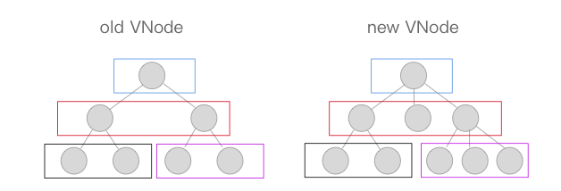
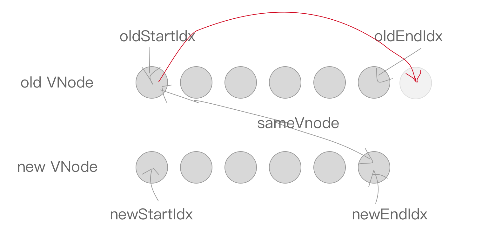
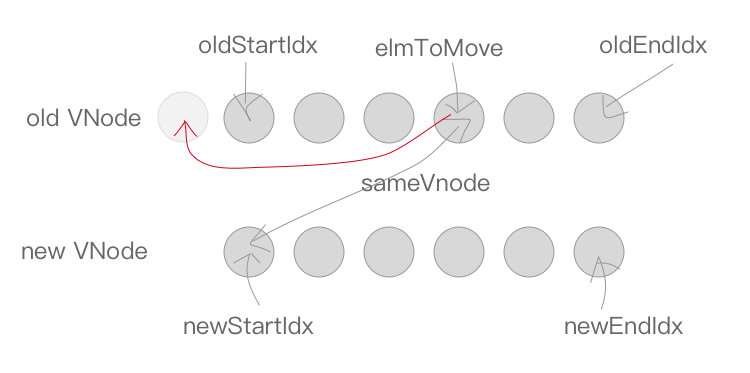
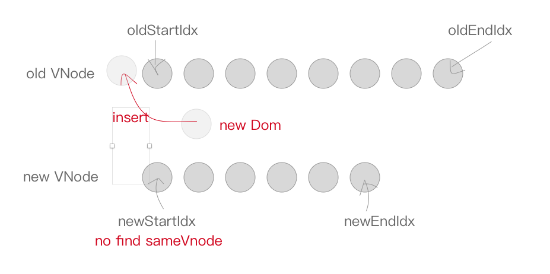
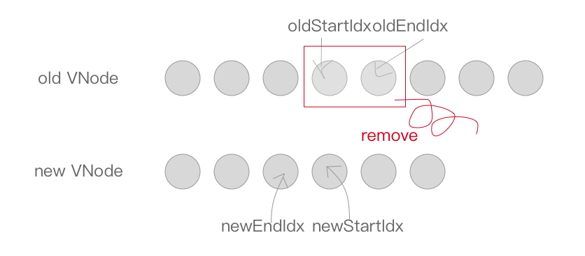

# 目标
+ 理解Vue批量异步更新策略
+ 掌握虚拟DOM和Diff算法

[总结的思维导图](https://www.processon.com/mindmap/64d391ece55181435686cc5f)

## 异步更新队列
Vue高效的秘诀是一套批量、异步的更新策略。

### 概念解释

+ 事件循环Event Loop: 浏览器为了协调时间处理、脚本执行、网络请求和渲染等任务而制定的工作机制。
+ 宏任务Task: 代表一个个离散的、独立的工作单元。浏览器完成一个宏任务，在下一个宏任务执行开始前，会对页面进行重新渲染，主要包括创建文档对象、解析HTML、执行主线js代码以及各种事件如页面加载、输入、网络事件和定时器等。
+ 微任务microtasks: 微任务是更小的任务，是在当前宏任务执行结束后立即执行的任务。如果存在微任务，浏览器会清空微任务之后再重新渲染。微任务的例子有Promise回调函数、DOM变化等。

[task体验-歪果仁](https://jakearchibald.com/2015/tasks-microtasks-queues-and-schedules/?utm_source=html5weekly)

### vue中的具体实现


+ 异步：只有监听到数据变化，Vue将开启一个队列，并缓冲在同一时间循环中发生的所有数据变更。
+ 批量：如果同一个watcher被多次触发，只会被推入到队列中一次。去重对于避免不必要的计算和DOM操作是非常重要的。然后，在下一个的事件循环'tick'中，Vue刷新队列执行实际工作。
+ 异步策略：Vue在内部对异步队列尝试使用原生的Promise.then,MutationObserver或setImmediate，如果执行环境都不支持，则采用setTimeout代替。

**update() core\observer\watcher.js**

dep.notify()之后watcher执行更新，执行入队操作

**queueWatcher(watcher) core\observer\scheduler.js**

执行watcher入队操作

**nextTick(flushSchedulerQueue) core\util\next-tick.js**

nextTick按照特定异步策略执行队列操作

## 虚拟DOM

### 概念
虚拟DOM(Virtual DOM)是对DOM的js抽象表示，它们是JS对象，能描述DOM结构和关系。应用的各种状态变化会作用于虚拟DOM，最终映射到DOM上。



### 体验虚拟DOM
Vue中虚拟dom基于snabbdom实现。
```html
<!DOCTYPE html>
<html lang="en">
<head></head>
<body>
<div id="app"></div>
<!--安装并引入snabbdom-->
<script src="https://cdn.bootcdn.net/ajax/libs/snabbdom/0.7.4/snabbdom.min.js"></script>
<script>
  // 之前编写的响应式函数
  function defineReactive(obj, key, val) {
    Object.defineProperty(obj, key, {
      get() {
        return val
      },
      set(newVal) {
        val = newVal
        // 通知更新
        update()
      },
    })
  }

  // 导入patch的工厂init，h是产生VNode的工厂
  const {init, h} = snabbdom
  // 获取patch函数
  const patch = init([])
  // 上次VNode，由patch()返回
  let VNode;

  // 更新函数，将数据操作转换为dom操作，返回新VNode
  function update() {
    if (!VNode) {
      // 初始化，没有上次VNode，传入宿主元素和VNode
      VNode = patch(app, render())
    } else {
      // 更新，传入新旧VNode对比并做更新
      VNode = patch(VNode, render())
    }
  }

  // 渲染函数，返回VNode描述dom结构
  function render() {
    return h('div', obj.foo)
  }

  // 数据 
  const obj = {}
  // 定义响应式 
  defineReactive(obj, 'foo', '')
  // 赋一个日期作为初始值 
  obj.foo = new Date().toLocaleTimeString()
  // 定时改变数据，更新函数会重新执行
  setInterval(() => {
    obj.foo = new Date().toLocaleTimeString()
  }, 1000);
</script>
</body>
</html>   
```

#### 优点
+ 虚拟DOM轻量、快速：当它们发生变化时通过新旧虚拟DOM比对可以得到最小DOM操作量，配合异步更新策略减少刷新频率，从而提升性能
```js
patch(VNode, h('div', obj.foo))
```
+ 跨平台：将虚拟dom更新转换为不同运行时特殊操作实现跨平台
+ 兼容性：还可以加入兼容性代码增强操作的兼容性

#### 必要性
vue1.0有细粒度的数据变化侦测，它所不需要虚拟DOM的，但是细粒度造成大量开销，这对于大型项目来说所不可接受。因此，vue2.0选择了中等粒度的解决方案，每一个组件一个watch实例，这样状态变化时只能通知组件，再通过引入虚拟DOM去进行比对和渲染。

#### 整体流程

**mountComponent() core/instance/lifecycle.js**

渲染、更新组件

```js
// 定义更新函数 const
updateComponent = () => {
  // 实际调用是在lifeCycleMixin中定义的_update和renderMixin中定义的_render
  vm._update(vm._render(), hydrating)
}
```

**_render core/instance/render.js**

生成虚拟dom

**_update core\instance\lifecycle.js**

update负责更新dom，转换VNode为dom

**__patch__() platforms/web/runtime/index.js**

__patch__是在平台特有代码中指定的

```js
Vue.prototype.__patch__ = inBrowser ? patch : noop
```

#### patch获取
patch是createPatchFunction的返回值，传递nodeOps和modules所web平台特别实现
```js
export const patch: Function = createPatchFunction({ nodeOps, modules })
```

**platforms\web\runtime\node-ops.js**

定义各种原生dom基础操作方法

**platforms\web\runtime\modules\index.js**

modules 定义了属性更新实现

watcher.run() => componentUpdate() => render() => update() => patch()

#### patch实现
**patch core\vdom\patch.js**

首先进行树级别比较，可能有三种情况：增删改。

+ new VNode不存在就删除；
+ old VNode不存在就新增；
+ 都存在就执行diff 执行更新



**patchVNode**

比较两个VNode，包括三种类型操作：属性更新，文本更新，子节点更新。
具体规则如下：
1. 新老节点均有children子节点，则对子节点进行diff操作，调用updateChildren
2. 如果新节点有子节点，而老节点没有子节点，先清空老节点的文本内容，然后为其新增子节点
3. 当新节点没有子节点，而老节点有子节点的时候，则移除该节点的所有子节点
4. 当新老节点都无子节点的时候，只是文本的替换

**updateChildren**

updateChildren主要作用是用一种较高效的方式比对新旧两个VNode的children得出最小操作补丁。
执行一个双循环所传统方式，vue针对web场景特点做了特别的算法优化。


在新老两组VNode节点的左右头尾两侧都有一个变量标记，在遍历过程中这几个变量都会向中间靠拢，当`oldStartIdx>oldEndIdx`或者`newStartIdx>newEndIdx`时结束循环。

下面时遍历规则：
首先，oldStartVNode、oldEmdVmode 与 newStartVNode、newEndVNode两两交叉比较，共有四种比较方法。

当oldStartVNode和newStartVNode 或者 oldEndVNode和newEndVNode满足sameVNode，直接将该VNode节点进行patchVNode即可，不需再遍历就完成一次循环。


如果oldStartVNode和newEndVNode满足sameVNode。说明oldStartVNode已经跑到oldEndVNode后面去了，进行patchVNode的同时还需要将正式DOM节点移动到oldEndVNode的后面。



如果oldEndVNode与newStartVNode满足sameVNode，说明oldEenVNode跑到了oldStartVNode的前面，进行patchVNode的同时要将oldEndVNode对应DOM移动到oldStartVNode对应DOM的前面。


如果以上情况均不符合，则在oldVNode中找与newStartVNode相同的节点，若存在执行patchVNode，同时将elmToMove移动到oldStartIdx对应的DOM的前面。



当然也有可能newStartVNode在oldVNode中找不到一致的sameVNode，这个时候会调用createEle创建一个新的DOM节点。



至此循环结束，但是我没还需要处理剩下的节点。

当结束时oldStartIdx>oldEndIdx，这个时候旧的VNode节点已经遍历完了，但是新的节点还没有，说明了新的VNode节点事件上比老的VNode多，需要将剩下的VNode对应的DOM插入到真实DOM中，此时调用addVNodes(批量调用createElm接口)。


但是，当结束时newStartIdx>newEndIdx时，说明新的VNode节点已经遍历完了，但是老的节点还有剩余，需要从文档中删除。



> key的作用 判断两个VNode是否相同节点
