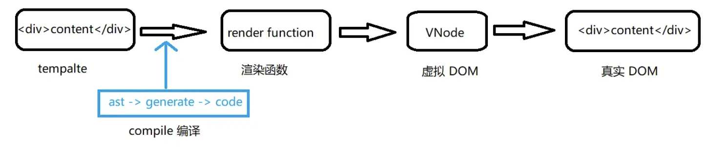

[村长-原文链接](https://github.com/57code/vue-interview)

[村长-视频链接](https://www.bilibili.com/video/BV11i4y1Q7H2/?vd_source=3cf5150c83707fd658ae9eb368adbc01)

> 以下内容仅用来自己学习复习用。
> 原文链接与视频链接请看上面。

## 1. Vue组件之间通信方式有哪些
vue是组件化开发框架，所以对于vue应用来说组件间的数据通信非常重要。此题主要考察vue基本功，对于vue基础api运用熟练度。另外一些边界知识，如provide/inject/$attrs则体现了面试者的知识广度。

### 思路分析: 总分
1. 总述知道的所有方式
2. 按组件关系阐述使用场景

### 回答
1. 组件通信方式大体有以下8种：
   + props
   + $emit/~~$on~~
   + ~~$children~~/$parent
   + $attrs/~~$listeners~~
   + ref
   + $root
   + eventbus
   + vuex
2. 根据组件之间关系讨论组件通信
   + 父子组件
     + props
     + $emit/$on
     + $parent/$children
     + ref
     + $attrs/$listeners
   + 兄弟组件
     + $parent
     + $eventbus
     + vuex
   + 跨层级组件
     + provide/inject
     + $root
     + eventbus
     + vuex

## 2. v-if和v-for哪个优先级更高？
### 思路分析：总分总模式
1. 先说结论
2. 为什么是这样的
3. 它们能放在一起吗
4. 如果不能，那应该怎样
5. 总结

### 回答
1. 在`Vue2`中，`v-for`优先于`v-if`被解析；但是在`vue3`中完全相反，`v-if`的优先级高于`v-for`
2. 我曾经做过实验，把`Vue2`输出的渲染函数`app.$options.render`打印出来，可以看出所先执行循环在判断条件
3. 不应该放在一起，因为就是我们只渲染列表中的一部分元素，也得在每次组件重新渲染的时候会遍历整个列表
4. 通常有两种场景会导致我们这样做：
   + 为了过滤列表中的项目 (比如`v-for="user in users" v-if="user.isActive"`)。此时定义一个计算属性 (比如`activeUsers`)，让其返回过滤后的列表即可。
   + 为了避免渲染本应该被隐藏的列表 (比如`v-for="user in users" v-if="shouldShowUsers"`)。此时把`v-if`移动至容器元素上 (比如 ul、ol)即可。
5. 官方文档明确指出永远不要把`v-if`和`v-for`同时用在同一元素上，显然是一个重要的注意事项
6. 看过源码里关于代码生成的部分，能够看到是先处理`v-if`还是`v-for`

### 知其所以然
在Vue2中的测试显示的渲染函数：
```js
ƒ anonymous(
) {
with(this){return _c('div',{attrs:{"id":"app"}},_l((items),function(item){return (item.isActive)?_c('div',{key:item.id},[_v("\n      "+_s(item.name)+"\n    ")]):_e()}),0)}
}
```
在vue3中的测试显示的渲染函数：
```js
(function anonymous(
) {
const _Vue = Vue

return function render(_ctx, _cache) {
  with (_ctx) {
    const { renderList: _renderList, Fragment: _Fragment, openBlock: _openBlock, createElementBlock: _createElementBlock, toDisplayString: _toDisplayString, createCommentVNode: _createCommentVNode } = _Vue

    return shouldShowUsers
      ? (_openBlock(true), _createElementBlock(_Fragment, { key: 0 }, _renderList(items, (item) => {
          return (_openBlock(), _createElementBlock("div", { key: item.id }, _toDisplayString(item.name), 1 /* TEXT */))
        }), 128 /* KEYED_FRAGMENT */))
      : _createCommentVNode("v-if", true)
  }
}
})
```

源码中找答案：
+ [Vue 2](https://github1s.com/vuejs/vue/blob/dev/src/compiler/codegen/index.js#L65-L69)
+ [Vue 3](https://github1s.com/vuejs/core/blob/main/packages/compiler-core/src/codegen.ts#L586-L587)

## 3. 简述vue生命周期
### 思路
1. 给出概念
2. 列举生命周期各阶段
3. 阐述整体流程
4. 结合实践
5. 扩展：vue3变化

### 回答范例
1. 每个Vue组件实例被创建后都会经过一系列初始化布置，比如，数据观测，模板编译，挂载实例到dom上，以及数据变化时更新dom。这个过程中会运行叫做生命周期的函数，以便用户在特定阶段有机会添加它们自己的代码。
2. Vue生命周期总共可以分为8个函数，创建前后，载入前后，更新前后，销毁前后，以及一些特殊场景的生命周期。vue3新增了三个用于调试和服务端渲染场景。

| 生命周期v2    | 生命周期v3          | 描述                                     |
| ------------- | ------------------- | ---------------------------------------- |
| beforeCreate  | beforeCreate        | 组件实例被创建之初                       |
| created       | created             | 组件实例已经完全创建                     |
| beforeMount   | beforeMount         | 组件挂载之前                             |
| mounted       | mounted             | 组件挂载到实例上去之后                   |
| beforeUpdate  | beforeUpdate        | 组件数据发生变化，更新之前               |
| updated       | updated             | 数据数据更新之后                         |
| beforeDestroy | **beforeUnmount** | 组件实例销毁之前                         |
| destroyed     | **unmounted**       | 组件实例销毁之后                         |
| activated     | activated           | keep-alive 缓存的组件激活时              |
| deactivated   | deactivated         | keep-alive 缓存的组件停用时调用          |
| errorCaptured | errorCaptured       | 捕获一个来自子孙组件的错误时被调用       |
| -             | **renderTracked**   | 调试钩子，响应式依赖被收集时调用         |
| -             | **renderTriggered** | 调试钩子，响应式依赖被触发时调用         |
| -             | **serverPrefetch**  | ssr only，组件实例在服务器上被渲染前调用 |

3. Vue生命周期流程图
   1. 
   2. 
4. 结合实践
   + **beforeCreate**: 通常用于插件开发中执行一些初始化任务
   + **created**: 组件初始化完毕，可以访问各种数据，获取接口数据等
   + **mounted**：dom已创建，可用于获取访问数据和dom元素；访问子组件等
   + **beforeUpdate**: 此时`view`层还未更新，可用于获取更新前各种状态
   + **update**: 完成`view`层的更新，更新后，所有状态已经所最新
   + **beforeUnmount**:实例被销毁前调用，可用于一些定时器或订阅的取消
   + **unmounted**: 销毁一个实例。可清理它与其他实例的连接，解绑它的全部指令及事件监听器
### 可能的追问
   1. setup和created谁先执行？
   2. setup中为什么没有beforeCreated和created?
### 知其所以然
+ [vue3中生命周期的派发时刻](https://github1s.com/vuejs/core/blob/HEAD/packages/runtime-core/src/componentOptions.ts#L554-L555)
+ [vue2中声明周期的派发时刻](https://github1s.com/vuejs/vue/blob/HEAD/src/core/instance/init.js#L55-L56)

## 4.v-model使用和原理
### 思路分析
1. 给出双绑订阅
2. 双绑带来的好处
3. 在哪里使用双绑
4. 使用方式
5. 扩展：使用细节、原理实现描述
### 回答范例
1. Vue中双向绑定是一个指令v-model，可以绑定一个动态值到视图，同时视图中变化能改变该值。v-model是语法糖，默认情况下相当于.value和@input
2. 使用v-model可以减少大量繁琐的事件处理代码，提高开发效率，代码可读性也更好
3. 通常在表单项上使用v-model
4. 原生的表单项可以直接使用v-model，自定义组件上如果使用它需要再组件内绑定value并处理输入事件
5. 我打印过包含v-model模板的组件渲染函数，发现它会被转换为value属性的绑定和一个事件监听，事件回调函数中会做想要变量更新操作，说明实际上是vue的编译器完成的
### 可能的追问
1. v-model和sync修饰符有什么区别？
   + 相同点：
     + 都是语法糖，都可以实现父子组件中的数据的双向通信
   + 不同点：
     + 格式不同：v-model="num"  :num.sync="num"
     + v-model  @input + :value = "num"
     + :num.sync  @update:a + :a = "num"
     + v-model只能使用一次，.sync可以有多个
2. 自定义组件使用v-model如果想改变事件名和属性名应该怎么做？
   + vue3和vue2不同，当使用v-model时，不论是绑定多个值还是单个值，vue3都不必要写model:{prop:'xxx', event: 'xxx'}，vue2则必须要写
   + vue3和vue2都必须要定义props:{xxx: [String, Number]}
   + vue3默认值 modelValue  vue2默认值 model{prop:value, event: input}
### 知其所以然
```js
// <input type="text" v-model="foo">
_c('input', { 
  directives: [{ name: "model", rawName: "v-model", value: (foo), expression: "foo" }], 
  attrs: { "type": "text" }, 
  domProps: { "value": (foo) }, 
  on: { 
    "input": function ($event) { 
      if ($event.target.composing) return; 
      foo = $event.target.value 
    } 
  } 
})
```

```js
// <input type="checkbox" v-model="bar">
_c('input', { 
  directives: [{ name: "model", rawName: "v-model", value: (bar), expression: "bar" }], 
  attrs: { "type": "checkbox" }, 
  domProps: { 
    "checked": Array.isArray(bar) ? _i(bar, null) > -1 : (bar) 
  }, 
  on: { 
    "change": function ($event) { 
      var $$a = bar, $$el = $event.target, $$c = $$el.checked ? (true) : (false); 
      if (Array.isArray($$a)) { 
        var $$v = null, $$i = _i($$a, $$v); 
        if ($$el.checked) { $$i < 0 && (bar = $$a.concat([$$v])) } 
        else { 
          $$i > -1 && (bar = $$a.slice(0, $$i).concat($$a.slice($$i + 1))) } 
      } else { 
        bar = $$c 
      } 
    } 
  } 
})
```

```js
// <select v-model="baz">
//     <option value="vue">vue</option>
//     <option value="react">react</option>
// </select>
_c('select', { 
  directives: [{ name: "model", rawName: "v-model", value: (baz), expression: "baz" }], 
  on: { 
    "change": function ($event) { 
      var $$selectedVal = Array.prototype.filter.call(
        $event.target.options, 
        function (o) { return o.selected }
      ).map(
        function (o) { 
          var val = "_value" in o ? o._value : o.value; 
          return val 
        }
      ); 
      baz = $event.target.multiple ? $$selectedVal : $$selectedVal[0] 
    } 
  } 
}, [
  _c('option', { attrs: { "value": "vue" } }, [_v("vue")]), _v(" "), 
  _c('option', { attrs: { "value": "react" } }, [_v("react")])
])
```

## 5.Vue中如何扩展一个组件
### 思路分析
1. 按照逻辑扩展和内容扩展来列举
   + 逻辑扩展：mixins、extends、composition api;
   + 内容扩展：slots;
2. 分别说出它们的使用方法、场景差异、和问题
3. 作为扩展，还可以说说vue3中新引入的composition api带来的变化
### 回答范例
1. 常见的组件扩展方法有：mixins，slots，extends等
2. 混入mixins是分发 Vue 组件中可复用功能的非常灵活的方式。混入对象可以包含任意组件选项。当组件使用混入对象时，所有混入对象的选项将被混入该组件本身的选项。
```js
// 复用代码：它是一个配置对象，选项和组件里面一样
const mymixin = {
	methods: {
		dosomething(){}
	}
}
// 全局混入：将混入对象传入
Vue.mixin(mymixin)

// 局部混入：做数组项设置到mixins选项，仅作用于当前组件
const Comp = {
	mixins: [mymixin]
}
```
3. 插槽主要用于vue组件中的内容分发，也可以用于组件扩展。

子组件Child

```vue
<div>
  <slot>这个内容会被父组件传递的内容替换</slot>
</div>
```
父组件Parent

```vue
<div>
	<Child>来自老爹的内容</Child>
</div>
```
如果要精确分发到不同位置可以使用具名插槽，如果要使用子组件中的数据可以使用作用域插槽。

4. 组件选项中还有一个不太常用的选项extends，也可以起到扩展组件的目的
```js
// 扩展对象
const myextends = {
	methods: {
		dosomething(){}
	}
}
// 组件扩展：做数组项设置到extends选项，仅作用于当前组件
// 跟混入的不同是它只能扩展单个对象
// 另外如果和混入发生冲突，该选项优先级较高，优先起作用
const Comp = {
	extends: myextends
}
```

5. 混入的数据和方法不能明确判断来源且可能和当前组件内变量产生命名冲突，vue3中引入的composition api，可以很好解决这些问题，利用独立出来的响应式模块可以很方便的编写独立逻辑并提供响应式的数据，然后在setup选项中有机组合使用。例如：
```js
// 复用逻辑1
function useXX() {}
// 复用逻辑2
function useYY() {}
// 逻辑组合
const Comp = {
	setup() {
		const {xx} = useXX()
		const {yy} = useYY()
		return {xx, yy}
	}
}
```

### 可能的追问
Vue.extend方法你用过吗？它能用来做组件扩展吗？
+ 作用所扩展组件生成一个构造器，通常和$mount一起使用
+ ElementUI里的$message，我们使用this.$message('hello')的时候，其实就是通过这种方式创建一个组件实例，然后再将这个组件挂载到了body上
+ [参考](https://juejin.cn/post/6914970829621035021)

## 6.子组件可以修改父组件中的数据吗 onw-way data flow
### 思路
1. 讲讲单项数据流原则，表明为何不能这么做
2. 举几个场景场景的例子说说解决方案
3. 结合实践讲讲如果需要修改父组件状态应该如何做

### 回答范例
1. 所有的prop都使得其父子之间形成了一个单选下行绑定；父级prop的更新会向下流动到子组件中，但是反过来不行。这样会防止从子组件意外变更父组件状态，从而导致你的应用的数据流向难以理解。另外，每次父级组件发生变更时，子组件所有的prop都将会刷新为最新的值。这意味着你不应该在一个子组件内部改变prop。如果你这样做了,Vue会在浏览器控制台中发出警告。 const props = defineProps(['foo']) // ❌ 下面行为会被警告, props是只读的! props.foo = 'bar'
2. 实际开发过程中会有两个场景会想要修改一个属性
   + 这个prop用来传递一个初始值；这个子组件接下来希望将其作为本地的prop数据来使用。再这种情况下，最好定义一个本地的data，并将这个prop用作初始值。const props = defineProps(['initialCounter']) const counter = ref(props.initialCounter)
   + 这个prop以一种原始的值传入且需要进行转换。再这种情况下，最好使用这个prop的值来定义一个计算属性：const props = defineProps(['size']) // prop变化，计算属性自动更新 const normalizedSize = computed(() => props.size.trim().toLowerCase())
3. 实践中如果确实想要改变父组件属性应该emit一个事件，让父组件去做这个变更。注意虽然我们不能直接修改一个传入的对象或数组类型的prop，但是我们还是能够修改内嵌的对象或属性。

## 7.Vue项目权限管理如何做
### 分析
综合实践题目，实际开发中经常需要面临权限管理的需求，考查实际应用能力。

权限管理一般需求是两个，页面权限和按钮权限，从这两个方面论述即可。

### 思路
1. 权限管理需求分析：页面和按钮权限
2. 权限系统的实现方案：分后端方案和前端方案阐述
3. 说说各自的优缺点

### 回答范例
1. 权限管理一般需求是**页面权限**和**按钮权限**的管理
2. 具体实现的时候分后端和前端两种方案
   + 前端方案会**把所有路由信息再前端配置**，通过路由守卫要求用户登录，用户**登录后根据角色过滤路由表**。比如我会配置一个`asyncRoutes`数组，需要认证的页面在其路由的meta中添加一个roles字段，等获取用户角色之后取两者的交集，若结果不为空则说明可以访问。此过滤过程结束，剩下的路由就是改用户能访问的页面，**最后通过router.addRoute(accessRoutes)方式动态添加路由**即可。
   + 后端方案会**把所有页面路由信息存在数据库中**，用户登录的时候根据其角色**查询得到其能访问的所有页面路由信息**返回给前端，前端**再通过addRoutes动态添加路由**信息
   + 按钮权限的控制通常会**实现一个指令**，例如`v-permission`，**将按钮要求角色通过值传递给v-permission指令**，在指令的mounted钩子中可以**判断当前用户角色和按钮是否存在交集**，有则保留按钮，无则移除按钮
3. 纯前端方案的优点是实现简单，不需要额外权限管理页面，但是维护起来问题比较大，有新的页面和角色需求就要修改前端代码重新打包部署；服务端方案就不存在这个问题，通过专门的角色和权限管理页面，配置页面和按钮权限信息到数据库，应用每次登陆时获取的都是最新的路由信息，可谓一劳永逸！

### 知其所以然
+ [路由守卫](https://github1s.com/PanJiaChen/vue-element-admin/blob/HEAD/src/permission.js#L13-L14)
+ [路由生成](https://github1s.com/PanJiaChen/vue-element-admin/blob/HEAD/src/store/modules/permission.js#L50-L51)
+ [动态追加路由](https://github1s.com/PanJiaChen/vue-element-admin/blob/HEAD/src/permission.js#L43-L44)

### 可能的追问
1. 类似Tabs这类组件能不能使用v-permission指令实现按钮权限控制？
```vue
<el-tabs> 
  <el-tab-pane label="⽤户管理" name="first">⽤户管理</el-tab-pane> 
	<el-tab-pane label="⻆⾊管理" name="third">⻆⾊管理</el-tab-pane>
</el-tabs>
```
2. 服务端返回的路由信息如何添加到路由器中？
```js
// 前端组件名和组件映射表
const map = {
  //xx: require('@/views/xx.vue').default // 同步的⽅式
  xx: () => import('@/views/xx.vue') // 异步的⽅式
}
// 服务端返回的asyncRoutes
const asyncRoutes = [
  { path: '/xx', component: 'xx',... }
]
// 遍历asyncRoutes，将component替换为map[component]
function mapComponent(asyncRoutes) {
  asyncRoutes.forEach(route => {
    route.component = map[route.component];
    if(route.children) {
      route.children.map(child => mapComponent(child))
    }
	})
}
mapComponent(asyncRoutes)
```

## 8.说说对Vue数据响应式的理解
### 思路分析
1. 啥是响应式
2. 为什么Vue需要响应式
3. 它能给我们带来什么好处
4. Vue的响应式是怎么实现的？有哪些优缺点
5. Vue3中的响应式的新变化

### 回答范例
1. 所谓数据响应式就是能够使数据变化可以被检查并对这种变化做出响应的机制
2. mvvm框架中要解决的一个核心问题是连接数据层和视图层，通过数据驱动应用，数据变化，视图更新，要做到这点就需要对数据做响应式处理，这样一旦数据发生变化就可以立即做出更新处理
3. 以vue为例说明，通过数据响应式加上虚拟dom和patch算法，可以使我们只需要操作数据，完全不用接触繁琐的dom操作，从而大大提升开发效率，降低开发难度
4. vue2中的数据响应式会根据数据类型来做不同处理，如果是对象则采用Object.defineProperty()的方式定义数据拦截，当数据被访问或发生变化时，我们感知并作出响应；如果是数组则通过覆盖该数组原型的办法，扩展它的7个变更方法，使这些方法可以额外的做更新通知，从而作出响应。这种机制很好的解决了数据响应化的问题，但在实际使用中也存在一些缺点：比如初始化时的递归遍历会造成性能损失；新增或删除属性时需要用户使用Vue.set/delete这样特殊的api才能生效；对于es6中新增的Map、Set这种数据结构不支持等问题
5. 为了解决这些问题，vue3重新编写了这一部分的实现：利用ES6的proxy机制代理要响应化的数据，它有很多好处，编程体验一致，不需要使用特殊api，初始化性能和内存消耗都得到了大幅改善；另外由于响应化的实现代码抽取为独立的reactivity包，使得我们可以更灵活的使用它，我们甚至不需要引入vue都可以体验。

### 知其所以然
+ [vue2响应式](https://github1s.com/vuejs/vue/blob/HEAD/src/core/observer/index.ts#L128)
+ [vue3响应式 reactive](https://github1s.com/vuejs/core/blob/HEAD/packages/reactivity/src/reactive.ts#L89-L90)
+ [vue3响应式 ref](https://github1s.com/vuejs/core/blob/HEAD/packages/reactivity/src/ref.ts#L67-L68)

## 9.虚拟DOM
### 思路
1. vDom是什么
2. 引入vDom的好处
3. vDom如何生成，又如何成为dom
4. 再后续的diff中的作用

### 回答范例
1. 虚拟dom顾名思义就是虚拟的dom对象，它本身就是一个js对象，只不过它是通过不同的属性去描述一个视图结构
2. 通过引入vDom我们可以获得如下好处：
   1. **将真实元素节点抽象成VNode，有效减少直接操作dom次数，从而提高程序性能**
      + 直接操作dom是有限制的，比如diff、clone等操作，一个真实元素上有许多的内容，如果直接对其进行diff操作，会去额外diff一些没有必要的内容；同样的，如果需要进行clone那么需要将其全部内容进行复制，这也是没有必要的。但是，如果将这些操作转移到js对象上，那么就会变的简单了
      + 操作dom是比较昂贵的操作，频繁的dom操作容易引起页面的重绘和回流，但是通过抽象VNode进行中间处理，可以有效减少直接操作dom的次数，从而减少页面重绘和回流
   2. **方便实现跨平台**
      + 同一VNode节点可以渲染成不同平台上的对应的内容，比如：渲染在浏览器是dom元素节点，渲染在Native（IOS,Android）变为对应的控件、可以实现SSR、渲染到webGL中等等
      + vue3允许开发者基于VNode实现自定义渲染器（render），以便于针对不同平台进行渲染
3. vDom是如何生成？在vue中，我们常常会为组件编写模板-template,这个模板会被编译器-compiler编译为渲染函数，在接下来的挂载mount过程中会调用render函数，返回的对象就是虚拟dom。但是他们还不是真正的dom，所以在后续的patch过程中进一步转化为dom

4. 挂载过程结束后，vue程序进入更新流程。如果某些响应式数据发生变化，将会引起组件重新render,此时就会生成新的vdom，和上一次的渲染结果diff就能得到变化的部分，从而转换为最小量的dom操作，高效更新试图。

### 知其所以然
+ [vnode定义](https://github1s.com/vuejs/core/blob/HEAD/packages/runtime-core/src/vnode.ts#L127-L128)
+ [创建vnode：createElementBlock:](https://github1s.com/vuejs/core/blob/HEAD/packages/runtime-core/src/vnode.ts#L291-L292)
+ [createVnode:](https://github1s.com/vuejs/core/blob/HEAD/packages/runtime-core/src/vnode.ts#L486-L487)
+ [mount:](https://github1s.com/vuejs/core/blob/HEAD/packages/runtime-core/src/renderer.ts#L1171-L1172)
调试mount过程：mountComponent

## 10.diff算法
### 分析


### 思路
1. diff算法是干什么的
2. 它的必要性
3. 它何时执行
4. 具体执行方式
5. 拔高：说一下vue3中的优化

### 回答范例
1. Vue中的diff算法称为patching算法，它由Snabbdom修改而来，虚拟DOM要想转化为真实DOM就需要通过patch方法转换
2. 最初Vue1.x视图中每个依赖均有更新函数对应，可以做到精准更新，因此并不需要虚拟DOM和patching算法支持，但是这样粒度过细导致Vue1.x无法承载较大应用；Vue2.x中为了降低Watcher粒度，每个组件只有一个Watcher与之对应，此时就需要引入patching算法才能精准找到发生变化的地方并高效更新
3. vue中diff执行的时刻是组件内响应式数据变更触发实例执行其更新函数时，更新函数会再次执行render函数获得最新的虚拟DOM，然后执行patch函数，并传入新旧两次虚拟DOM,通过两者比对找到变化的地方，最后将其转化为对应的DOM操作
4. patch过程是一个递归过程，遵循深度优先、同层比较的策略；以Vue3的patch为例：
   1. 首先判断两个节点是否为相同同类节点，不同则删除重新创建
   2. 如果双方都是文本则更新文本内容
   3. 如果双方都是元素节点则递归更新子元素，同时更新元素属性
   4. 更新子节点时又分了几种情况
      + 新的子节点是文本，老的子节点是数组则清空，并设置文本；
      + 新的子节点是文本，老的子节点是文本，则直接更新文本；
      + 新的子节点是数组，老的子节点是文本，则清空文本，并创建新子节点数组中的子元素
      + 新的子节点是数组，老的子节点是数组，那么比较两组子节点，
        + 首首：老开始和新开始相同，打补丁，游标同时向后移动
        + 尾尾：老结束和新结束相同，打补丁，游标向前移动
        + 首尾：老开始和新结束相同，打补丁，游标移动
        + 尾首：老结束和新开始相同，打补丁，游标移动
        + 首尾没有找到相同，老老实实查找
5. vue3中引入的更新策略：编译期优化patchFlags、block等

### 知其所以然
+ [patch关键代码](https://github1s.com/vuejs/core/blob/HEAD/packages/runtime-core/src/renderer.ts#L354-L355)

## 11.说说你知道的vue3新特性
### 分析
官网列举的最值得注意的[新特性](https://v3-migration.vuejs.org/zh/)

也就是下面这些
+ Composition API
+ SFC Composition API语法糖
+ Teleport传送门
+ Fragments片段
+ Emits选项
+ 自定义渲染器
+ SFC CSS变量
+ Suspense
以上这些是api相关，另外还有很多框架特性

### 回答范例
1. api层面Vue3新特性主要包括：Composition API、SFC Composition API语法糖、Teleport传送门、Fragments 片段、Emits选项、自定义渲染器、SFC CSS变量、Suspense
2. 另外，Vue3.0在框架层面也有很多亮眼的改进：
   + 更快
     + 虚拟DOM重写
     + 编译器优化：静态提示、patchFlags、block等
     + 基于Proxy的响应式系统
   + 更小：更好的摇树优化
   + 更容易维护：TypeScript + 模块化
   + 更容易扩展
     + 独立的响应化模块
     + 自定义渲染器

### 知其所以然
+ [体验编译器优化](https://sfc.vuejs.org/)
+ [reactive实现](https://github1s.com/vuejs/core/blob/HEAD/packages/reactivity/src/reactive.ts#L90-L91)

## 12.vue-router动态路由有什么用？
### 思路
1. 什么是动态路由
2. 什么时候使用动态路由，怎么定义动态路由
3. 参数如何获取 
4. 细节，注意事项

### 回答范例
1. 很多时候，我们需要**将给定匹配模式的路由映射到同一个组件**，这种情况就需要定义动态路由
2. 例如，我们可能有一个 User 组件，它应该对所有用户进行渲染，但用户 ID 不同。在 Vue Router 中，我们可以在路径中使用一个动态字段来实现，例如：`{ path: '/users/:id', component: User }`，其中:id就是路径参数
3. 路径参数 用冒号 : 表示。当一个路由被匹配时，它的 params 的值将在每个组件中以`this.$route.params`的形式暴露出来。
4. 参数还可以有多个，例如`/users/:username/posts/:postId`；除了`$route.params`之外，`$route`对象还公开了其他有用的信息，如`$route.query`、`$route.hash`等。

### 可能的追问
1. [如何响应动态路由参数的变化](https://router.vuejs.org/zh/guide/essentials/dynamic-matching.html#%E5%93%8D%E5%BA%94%E8%B7%AF%E7%94%B1%E5%8F%82%E6%95%B0%E7%9A%84%E5%8F%98%E5%8C%96)
2. [如何处理404 Not Found路由](https://router.vuejs.org/zh/guide/essentials/dynamic-matching.html#%E6%8D%95%E8%8E%B7%E6%89%80%E6%9C%89%E8%B7%AF%E7%94%B1%E6%88%96-404-Not-found-%E8%B7%AF%E7%94%B1)

## 13.如何实现一个vue-router?
### 思路分析
首先思考Vue路由要解决的问题：用户点击跳转链接内容切换，页面不刷新
+ 借助hash或者history api实现url跳转页面不刷新
+ 同时监听hashchange事件或者popstate事件处理跳转
+ 根据hash值或者state值从routes表中匹配对应component并渲染它

### 回答范例
一个SPA应用的路由需要解决的问题是**页面跳转内容改变同时不刷新**，同时路由还需要以插件形式存在，所以：
1. 首先我会定义一个`createRouter`函数，返回路由器实例，实例内部做几件事
   1. 保存用户传入的配置项
   2. 监听hash或者popstate事件
   3. 回调里根据patch匹配对应路由
2. 将router定义成一个Vue插件，既实现install方法，内部做两件事：
   1. 实现两个全局组件：`router-link`和`router-view`，分别实现页面跳转和内容显示
   2. 定义两个全局变量：`$route`和`$router`，组件内可以访问当前路由和路由器实例

### 知其所以然
+ [createRouter如何创建实例](https://github1s.com/vuejs/router/blob/HEAD/src/router.ts#L355-L356)
+ [事件监听](https://github1s.com/vuejs/router/blob/HEAD/src/history/html5.ts#L314-L315)
+ [页面跳转RouterLink](https://github1s.com/vuejs/router/blob/HEAD/src/RouterLink.ts#L184-L185)
+ [内容显示RouterView](https://github1s.com/vuejs/router/blob/HEAD/src/RouterView.ts#L43-L44)

## 14.key的作用
### 思路
1. 给出结论，key的作用是用于优化patch性能
2. key的必要性
3. 实际使用方式
4. 总结：可从源码层面描述一下vue如何判断两个节点是否想过

### 回答范例
1. key的作用主要是为了更高效的更新虚拟DOM
2. vue在patch过程中**判断两个节点是否是相同节点是key是一个必要条件**，渲染一组列表时，key往往是唯一标识，所以如果不定义key的话，vue只能认为比较的两个节点是同一个，哪怕它们实际上不是，这导致了频繁更新元素，使得整个patch过程比较低效，影响性能。
3. 实际使用中在渲染一组列表时key必须设置，而且必须是唯一标识，应该避免使用数组索引作为key，这可能导致一些隐藏的bug；vue中在使用相同标签元素过渡切换时，也会使用key属性，其目的也是为了让vue可以区分它们，否则vue只会替换其内部属性而不会触发过渡效果。
4. 从源码中可以知道，vue判断两个节点是否相同时主要判断两个的key和元素类型等，因此如果不设置key，它的值就是undefined，则永远认为这是两个相同节点，只能去做更新操作，这造成了大量的dom更新操作，明显是不可取的。

```vue
<template>
  <div>
    <p v-for="item in items" :key="item">{{item}}</p>
  </div>
</template>
<script>
export default{
  data() {
    return { items: ['a', 'b', 'c', 'd', 'e'] }
  },
  mounted () {
    setTimeout(() => {
      this.items.splice(2, 0, 'f')
    }, 2000);
  },
};
</script>
```

上面案例重现的是以下过程


不使用key


如果使用key

```
// 首次循环patch A
A B C D E
A B F C D E

// 第2次循环patch B
B C D E
B F C D E

// 第3次循环patch E
C D E
F C D E

// 第4次循环patch D
C D
F C D

// 第5次循环patch C
C 
F C

// oldCh全部处理结束，newCh中剩下的F，创建F并插入到C前面
```

## 15.nextTick使用和原理
### 思路
1. nextTick是啥？下定义
2. 为什么需要它？用异步更新队列实现原理解释
3. 我再什么地方用它呢？
4. 介绍如何使用
5. 说出源码实现

先看看官方订阅
> Vue.nextTick( [callback, context] )
> 在下次 DOM 更新循环结束之后执行延迟回调。在修改数据之后立即使用这个方法，获取更新后的 DOM。
```js
// 修改数据
vm.msg = 'Hello'
// DOM 还没有更新
Vue.nextTick(function () {
// DOM 更新了
})
```

### 回答范例
1. nextTick是Vue提供的一个全局API，由于vue的异步更新策略导致我们对数据的修改不会立刻体现在dom变化上，此时如果想要立即获取更新后的dom状态，就需要使用这个方法
2. Vue在更新DOM时是异步执行的。只要侦听到数据变化，Vue将开启一个队列，并缓冲在同一事件循环中发生的所有数据变更，如果同一个watcher被多次触发，只会被推入到队列中一次。这种在缓冲时去除重复数据对于避免不必要的计算和DOM操作所非常重要的。
   nextTick方法会在队列中加入一个回调函数，确保该函数在前面的dom操作完成后才调用。
3. 所以当我们想在修改数据后立即看到dom执行结果就需要用到nextTick方法。
4. 我也有简单了解nextTick实现，它会在callbacks里面加入我们传入的函数，然后用timeFunc异步方式调用它们，首选的异步方式会是promise。这让我明白了为什么可以在nextTick中看到dom操作结果。

### 回答范例
1. [nextTick](https://cn.vuejs.org/api/general.html#nexttick)是等待下一次DOM更新刷新的工具方法。
2. Vue有个异步更新策略，意思是如果数据变化，Vue不会立即更新DOM，而是开启一个队列，把组件更新函数保存在队列中，在同一事件循环中发生的所有数据变更会异步的批量更新。这一策略导致我们对数据的修改不会立刻体现在DOM上，此时如果想要获取更新后的DOM状态，就需要使用nextTick
3. 开发时，有两个场景我们会用到nextTick:
   1. created中想要获取DOM时
   2. 响应式数据变化后获取DOM更新后的状态，比如希望获取列表更新后的高度
4. nextTick签名如下：`function nextTick(callback? () => void): Promise<void>`
   所以我们只需要在传入的回调函数中访问最新DOM状态即可，或者我们可以await nextTick()方法返回的Promise之后做这件事
5. 在Vue内部，nextTick之所以能够让我们看到DOM更新后的结果，是因为我们传入的callback会被添加到队列刷新函数（flushSchedulerQueue）后面，这样等队列内部的更新函数都执行完毕，所有DOM操作也就结束了，callback自然能够获取到最新的DOM值

### 知其所以然
+ [组件更新函数入队](https://github1s.com/vuejs/core/blob/HEAD/packages/runtime-core/src/renderer.ts#L1547-L1548)
+ [入队函数](https://github1s.com/vuejs/core/blob/HEAD/packages/runtime-core/src/scheduler.ts#L79)
+ [nextTick定义](https://github1s.com/vuejs/core/blob/HEAD/packages/runtime-core/src/scheduler.ts#L53)

## 16.computed和watch的区别
### 思路
1. 先看[computed](https://cn.vuejs.org/api/reactivity-core.html#computed)、[watch](https://cn.vuejs.org/api/reactivity-core.html#watch)两者定义，列举使用上的差异
2. 列举使用场景上的差异，如何选择
3. 使用细节、注意实现
4. vue3变化

### 回答范例
1. 计算属性可以**从组件数据派生出新数据**，最常见的使用方式是设置一个函数，返回计算之后的具有响应式的结果，computed和methods的差异所它具备缓存性，如果依赖项不变时不会重新计算。侦听器**可以侦测某个响应式数据的变化并执行副作用**，常见用法是传递一个函数，执行副作用，watch没有返回值，但可以执行异步操作等复杂逻辑
2. 计算属性常见场景是简化行内模板中的复杂表达式，模板中出现太多逻辑会使模板变得臃肿不易维护。侦听器常见场景是状态变化之后做一些往额外的DOM操作或异步操作。选择采用何种方案时首先看是否需要派生出新值，基本能用计算属性实现的方式首选计算属性
3. 使用过程中有一些细节，比如计算属性也是可以传递对象，成为既可读又可写的计算属性。watch可以传递对象，设置deep、immediate等选项
4. vue3watch选项发生了一些变化，例如不再能监测一个点操作符之外的字符串的表达式；reactivity API中新出现了watch、watchEffect可以完全替代目前的watch选项，且功能更加强大

### 可能的追问
1. watch会不会立即执行？
   看immediate
2. watch和watchEffect有什么差异？
   [差异](https://cn.vuejs.org/guide/essentials/watchers.html#watcheffect)

### 知其所以然
+ [computed的实现](https://github1s.com/vuejs/core/blob/HEAD/packages/reactivity/src/computed.ts#L79-L80)
+ [ComputedRefImpl](https://github1s.com/vuejs/core/blob/HEAD/packages/reactivity/src/computed.ts#L26-L27)
+ [缓存性](https://github1s.com/vuejs/core/blob/HEAD/packages/reactivity/src/computed.ts#L45-L60)
+ [watch](https://github1s.com/vuejs/core/blob/HEAD/packages/runtime-core/src/apiWatch.ts#L172)

## 17.父子组件创建，挂载顺序所怎样的
### 思路
1. 给结论
2. 阐述理由

### 回答范例
1. 创建过程自下而上，挂载过程自下而上：
   + parent created
   + child created
   + child mounted
   + parent mounted
2. 之所以会这样所因为Vue创建过程是一个递归过程，先创建父组件，有子组件就会创建子组件，因此创建时先有父组件再有子组件；子组件首次创建时会添加mounted钩子到队列，等到patch结束再执行它们，可见子组件的mounted钩子是先进入队列中的，因此等到patch结束执行这些钩子时也先执行。

### 知其所以然
+ [观察beforeCreated和created钩子的处理](https://github1s.com/vuejs/core/blob/HEAD/packages/runtime-core/src/componentOptions.ts#L554-L555)
+ [观察beforeMount和mounted钩子的处理](https://github1s.com/vuejs/core/blob/HEAD/packages/runtime-core/src/renderer.ts#L1310-L1311)

## 18.如何缓存组件、缓存后怎么更新？
缓存组件使用keep-alive组件，这是一个常见且有用的优化手段，vue3中keep-alive也有比较大的更新，能说的点比较多
### 思路
1. 缓存用keep-alive，它的作用与用法
2. 使用细节，例如缓存指定/排除、结合router和transition
3. 组件缓存后更新可以利用activated或者beforeRouteEnter
4. 原理阐述

### 回答范例
1. 开发中缓存组件使用keep-alive组件，keep-alive是vue内置组件，keep-alive包裹动态组件component时，会缓存不活动的组件实例，而不是销毁它们，这样在组件切换过程中将状态保留在内存中，防止重复渲染DOM
```vue
<keep-alive>
  <component :is="view"></component>
</keep-alive>
```
2. 结合属性include和exclude可以明确指定缓存哪些组件或排除缓存指定组件。vue3结合vue-router时变化较大，之前所keep-alive包裹router-view，现在需要反过来用router-view包裹keep-alive
```vue
<router-view v-slot="{ Component }">
  <keep-alive>
    <component :is="Component"></component>
  </keep-alive>
</router-view>
```
3. 缓存后如果想要获取数据，解决方案可以有以下两种：
  + beforeRouteEnter：在有vue-router的项目，每次进入路由的时候，都会执行beforeRouteEnter
  + actived：在keep-alive缓存的组件被激活的时候，都会执行actived钩子
4. keep-alive是一个通用组件，它内部定义了一个map，缓存创建过的组件实例，它返回的渲染函数内部会查找内嵌的component组件对应组件的vnode，如果该组件在map中存在就直接返回它。由于component的is属性是个响应式数据，因此只要它变化，keep-alive的render函数就会重新执行。

### 知其所以然
+ [KeepAlive定义](https://github1s.com/vuejs/core/blob/HEAD/packages/runtime-core/src/components/KeepAlive.ts#L73-L74)
+ [缓存定义](https://github1s.com/vuejs/core/blob/HEAD/packages/runtime-core/src/components/KeepAlive.ts#L102-L103)
+ [缓存组件](https://github1s.com/vuejs/core/blob/HEAD/packages/runtime-core/src/components/KeepAlive.ts#L215-L216)
+ [获取缓存组件](https://github1s.com/vuejs/core/blob/HEAD/packages/runtime-core/src/components/KeepAlive.ts#L241-L242)

## 19.如何从0到1架构一个vue项目
### 思路
1. 构建项目，创建项目基本结构
2. 引入必要的插件
3. 代码规范：prettier eslint
4. 提交规范：husky list-staged
5. 其他常用：svg-loader vueuse nprogress
6. 常见目录结构

### 回答范例
1. 从0创建一个项目我大致会做以下事情：项目创建、引入必要插件、代码规范、提交规范、常用库和组件
2. 目前vue3项目我会用vite或者create-vue创建项目
3. 接下来引入必要插件：路由vue-router、状态管理pinia、ui库element-plus、http工具axios
4. 其他比较常用的库有vueuse、nprogress，图标使用icon-moon
5. 下面是代码规范：结合prettier和eslint
6. 最后是提交规范，可以使用husky、lint-staged、commitlint
7. 目录结构
   + plugins:用来放 vite 插件的 plugin 配置
   + public：用来放一些诸如 页头icon 之类的公共文件，会被打包到dist根目录下
   + src：用来放项目代码文件
   + api：用来放http的一些接口配置
   + assets：用来放一些 CSS 之类的静态资源
   + components：用来放项目通用组件
   + layout：用来放项目的布局
   + router：用来放项目的路由配置
   + store：用来放状态管理Pinia的配置
   + utils：用来放项目中的工具方法类
   + views：用来放项目的页面文件

## 20.你知道哪些Vue最佳实践？


### 思路
查看vue官方文档

+ [风格指南](https://vuejs.org/style-guide/)
+ [性能](https://vuejs.org/guide/best-practices/performance.html#overview)
+ [安全](https://vuejs.org/guide/best-practices/security.html)
+ [访问性](https://vuejs.org/guide/best-practices/accessibility.html)
+ [发布](https://vuejs.org/guide/best-practices/production-deployment.html)

### 回答范例
从编码风格、性能、安全等几方面说几条：
1. 编码风格方面
   1. 命名组件时使用“多词”风格避免和HTML元素冲突
   2. 使用“细节化”方式定义属性而不是只有一个属性名
   3. 属性名声明时使用“驼峰命名”，模板或jsx中使用“肉串命名”
   4. 使用v-for时务必加上key，且不要跟v-if写在一起
2. 性能方面
   1. 路由懒加载减少应用尺寸
   2. 利用SSR减少首屏加载时间
   3. 利用v-once渲染那些不需要更新的内容
   4. 一些长列表可以利用虚拟滚动技术避免内存过度占用
   5. 对于深层嵌套对象的大数组可以使用shallowRef或shallowReactive降低开销
   6. 避免不必要的组件抽象
3. 安全方面
   1. 不使用不可信模板，例如使用用户输入拼接模板：template: <div> + userProvidedString + </div>
   2. 小心使用v-html，:url，:style等，避免html、url、样式等注入

## 21.说说对vuex的理解
单向数据流


vuex


### 回答策略：3w1h
1. 首先给vuex下一个定义
2. 必要性阐述，解决了哪些问题
3. 什么时候我们需要vuex
4. 你的具体用法，个人思考，实践经验
5. 简述原理

> 官网定义
> Vuex 是一个专为 Vue.js 应用程序开发的**状态管理模式**。它采用**集中式**存储管理应用的所有组件的状态，并以相应的规则保证状态以一种**可预测**的方式发生变化。

### 回答范例
1. Vuex 是一个专为 Vue.is 应用开发的状态管理模式+库。它采用集中式存储，管理应用的所有组件的状态，并以相应的规则保证状态以一种可预测的方式发生变化。
2. 我们期待以一种简单的“单向数据流”的方式管理应用，即状态->视图->操作单向循环的方式。但当我们的应用遇到多个组件共享状态时，比如:多个视图依赖于同一状态或者来自不同视图的行为需要变更同一状态。此时单向数据流的简洁性很容易被破坏。因此，我们有必要把组件的共享状态抽取出来，以一个全局单例模式管理。通过定义和隔离状态管理中的各种概念并通过强制规则维持视图和状态间的独立性，我们的代码将会变得更结构化且易维护。这是vuex存在的必要性，它和react生态中的redux之类是一个概念。
3. vuex并非必须的，它帮我们管理共享状态，但却带来更多的概念和框架。Vuex 解决状态管理的同时引入了不少概念: 例如state、mutation、action等，是否需要引入还需要根据应用的实际情况衡量一下:如果不打算开发大型单页应用，使用 Vuex 反而是繁琐几余的，一个简单的 store 模式就足够了。但是，如果要构建一个中大型单页应用，Vuex 基本是标配
4. 我在使用vuex过程中有如下理解：首先是对核心概念的理解和运用，将全局状态放入state对象中，它本身一棵状态树，组件中使用store实例的state访问这些状态；然后有配套的mutation方法修改这些状态，并且只能用mutation修改状态，在组件中调用commit方法提交mutation；如果应用中有异步操作或者复杂逻辑组合，我们需要编写action，执行结束如果有状态修改仍然需要提交mutation，组件中调用这些action使用dispatch方法派发。最后是模块化，通过modules选项组织拆分出去的各个子模块，在访问状态时注意添加子模块的名称，如果子模块有设置namespace，那么在提交mutation和派发action时还需要额外的命名空间前缀。
5. vuex在实现单项数据流时需要做到数据的响应式，通过源码的学习发现是借用了vue的数据响应化特性实现的，它会利用Vue将state作为data对其进行响应化处理，从而使得这些状态发生变化时，能够导致组件重新渲染。

## 22.从template到render发生了什么？
### 分析
从template到render过程，其实是问vue编译器原理

### 思路
1. 引入vue编译器概念
2. 说明编译器的必要性
3. 阐述编译器工作流程

### 回答范例
1. vue中有个独特的模块，称为“compiler”，它的主要作用是将用户编写的template编译为js中可执行的render函数
2. 之所以需要这个编译过程是为了便于前端程序员能高效的编写视图模板。相比而言，我们还是更愿意用HTML来编写视图，直观且高效。手写render函数不仅效率低下，而且失去了编译期的优化能力
3. 在Vue中编译器会先对template进行解析，这一步称为parse，结束之后的会得到一个js对象，我们称为抽象语法树AST，然后是对AST进行深加工的转换过程，这一步称为transform，最后将前面得到的AST生成JS代码，也就是render函数

### 知其所以然
+ [vue3编译过程窥探](https://github1s.com/vuejs/core/blob/HEAD/packages/compiler-core/src/compile.ts#L61-L62)

### 可能的追问
1. vue中编译器何时执行？ 根据引入vue的运行时不同而不同。
   + webpack，预打包环境，vue-loader，在打包阶段将模板编译，预编译
   + 非运行时版本，携带编译器的vue版本，编译发生在运行时，组件创建阶段，发现组件没有render函数就会编译template
2. react有没有编译器？
   + jsx 不是编译器(compiler)，语言没有发生变化，是转义器(transpiler)，将jsx转成js，严格来说，没有编译器

## 23.vue实例挂载过程发生了什么？
### 分析
挂载过程完成了最重要的两件事：
1. 初始化
2. 建立更新机制（数据与视图关联）

### 回答范例
1. 挂载过程指的是app.mount()过程，这个是个初始化过程，整体上做了两件事：初始化和建立更新机制
2. 初始化会创建组件实例，初始化组件状态，创建各种响应式数据
3. 建立更新机制这一步会立即执行一次组件更新函数，这会首次执行组件渲染函数并执行patch将前面获得vnode转换为dom；同时首次执行渲染函数会创建它内部响应式数据和组件更新函数之间的依赖关系，这使得以后数据变化时会执行对应的更新函数

### 知其所以然
+ [mount函数](https://github1s.com/vuejs/core/blob/HEAD/packages/runtime-core/src/apiCreateApp.ts#L319)
+ [首次render](https://github1s.com/vuejs/core/blob/HEAD/packages/runtime-core/src/renderer.ts#L2320)

### 可能的追问
1. 响应式数据怎么创建
2. 依赖关系如何建立

## 24.Vue3设计目标和优化点有哪些？
### 思路
从以下几方面分门别类阐述：易用性、性能、扩展性、可维护性、开发体验等

### 回答范例
1. Vue3的最大设计目标所替代Vue2，为了实现这一点，Vue3在以下几个方面做了很大改进，如：易用性、框架性能、扩展性、可维护性、开发体验等
2. 易用性方面主要是API简化，比如v-model在Vue3中变成Vue2中v-model和sync修饰符的结合体，用户不用区分两者不同，也不用选择困难，类似的简化还有用于渲染函数内部生成VNode的h(type, props, children)，其中props不用考虑区分属性、特性、事件等，框架替我们判断，易用性大增
3. 开发体验方面，新组件teleport传送门，fragments，suspense等都会简化特定场景的代码编写，SFC composition API语法糖更是极大提升我们开发体验
4. 扩展性方面提升，如独立的reactivity模块，custom renderer API等
5. 可维护性方面主要是Composition API，更容易编写高复用性的业务逻辑，还有对TS支持的提升
6. 性能方面的改进也很显著，例如编译器优化，基于proxy的响应式系统

### 可能的追问
1. vue3做了哪些编译优化？
2. proxy和defineProperty有什么不同？

## 25. Vue优化方面有哪些？
### 回答范例
1. 这里我主要从Vue代码编写层面说一些优化手段，例如：代码分割，服务端渲染，组件缓存，长列表优化等
2. 最常见的路由懒加载：有效拆分APP尺寸，访问时才异步加载
```js
const router = createRouter({
  routes: [
    // 借助webpack的import()实现异步组件
    { path: '/foo', component: () => import('./Foo.vue') }
  ]
})
```
3. keep-alive缓存页面：避免重复创建组件实例，且能保留缓存组件状态
```vue
<router-view v-slot="{ Component }">
	<keep-alive>
  	<component :is="Component"></component>
  </keep-alive>
</router-view>
```
4. v-show复用组件：避免重复创建组件
5. v-for遍历避免同时使用v-if
6. v-once和v-memo：不再变化的数据使用v-once
```vue
<!-- single element -->
<span v-once>This will never change: {{msg}}</span>
<!-- the element have children -->
<div v-once>
  <h1>comment</h1>
  <p>{{msg}}</p>
</div>
<!-- component -->
<my-component v-once :comment="msg"></my-component>
<!-- `v-for` directive -->
<ul>
  <li v-for="i in list" v-once>{{i}}</li>
</ul>
```
按条件跳过更新时使用v-memo：下面这个列表只会更新选中状态变化项
```vue
<div v-for="item in list" :key="item.id" v-memo="[item.id === selected]">
  <p>ID: {{ item.id }} - selected: {{ item.id === selected }}</p>
  <p>...more child nodes</p>
</div>
```
7. 长列表性能优化：如果所大数据长列表，可采用虚拟滚动，只渲染少部分区域的内容
```vue
<recycle-scroller
  class="items"
  :items="items"
  :item-size="24"
>
  <template v-slot="{ item }">
    <FetchItemView
      :item="item"
      @vote="voteItem(item)"
    />
  </template>
</recycle-scroller>
```
> 一些开源库：
>
> - [vue-virtual-scroller](https://github.com/Akryum/vue-virtual-scroller)
> - [vue-virtual-scroll-grid](https://github.com/rocwang/vue-virtual-scroll-grid)
8. 事件的销毁：Vue组件销毁时，会自动解绑它的全部指令及事件监听器，但是仅限于组件本身的事件
```js
export default {
  created() {
    this.timer = setInterval(this.refresh, 2000)
  },
  beforeUnmount() {
    clearInterval(this.timer)
  }
}
```
9. 图片懒加载
   对于图片过多的页面，为了加速页面加载速度，所以很多时候我们需要将页面内未出现在可视区域内的图片先不做加载， 等到滚动到可视区域后再去加载。
```vue

```
> 参考项目：[vue-lazyload](https://github.com/hilongjw/vue-lazyload)
10. 第三方插件按需引入: 像element-plus这样的第三方组件库可以按需引入避免体积太大。
```js
import { createApp } from 'vue';
import { Button, Select } from 'element-plus';

const app = createApp()
app.use(Button)
app.use(Select)
```
11. 子组件分割策略：较重的状态组件适合拆分
```vue
<template>
  <div>
    <ChildComp/>
  </div>
</template>

<script>
export default {
  components: {
    ChildComp: {
      methods: {
        heavy () { /* 耗时任务 */ }
      },
      render (h) {
        return h('div', this.heavy())
      }
    }
  }
}
</script>
```
但同时也不宜过度拆分组件，尤其是为了所谓组件抽象将一些不需要渲染的组件特意抽出来，组件实例消耗远大于纯dom节点。参考：[避免不必要的组件抽象](https://cn.vuejs.org/guide/best-practices/performance.html#reduce-reactivity-overhead-for-large-immutable-structures)

12. 服务端渲染/静态网站生成：SSR/SSG。如果SPA应用有首屏渲染慢的问题，可以考虑SSR、SSG方案优化。参考[SSR Guide](https://cn.vuejs.org/guide/scaling-up/ssr.html)

## 26. Vue2组件为什么只能有一个根节点？
这题现在有些落伍了，vue3已经不用一个根了。
### 思路
1. 给自己一个结论
2. 解释为什么会这样
3. vue3解决方法原理

### 回答范例
1. vue2组件确实只能有一个根，但是vue3已经可以有多个根了
2. 之所以这样所因为vdom是一棵单根树形结构，patch方法在遍历的时候从根节点开始遍历，它要求只有一个根节点，组件也会转换为一个vdom，自然需要满足这个要求
3. vue3之所以可以写多个根节点，是因为引入了fragment的概念，这是一个抽象的节点，如果发现组件是多根的，就创建一个fragment节点，把多根节点作为它的children,将来patch的时候，如果发现所一个fragment节点，则直接遍历children创建或更新

### 知其所以然
+ [patch方法接收单根vdom](https://github1s.com/vuejs/core/blob/HEAD/packages/runtime-core/src/renderer.ts#L354-L355)
```js
// 直接获取type等，没有考虑数组的可能性
const { type, ref, shapeFlag } = n2
```
+ [patch方法对Fragment的处理](https://github1s.com/vuejs/core/blob/HEAD/packages/runtime-core/src/renderer.ts#L1091-L1092)
```js
// a fragment can only have array children
// since they are either generated by the compiler, or implicitly created
// from arrays.
mountChildren(n2.children as VNodeArrayChildren, container, ...)
```

## 27.什么情况需要使用Vuex模块？

## 28.为什么路由需要懒加载？

## 29.ref和reactive有何差异？

## 30.watch和watchEffect异同？

## 31.SPA和SSR异同？

## 32.vue-loader是什么？

## 33.你写过自定义指令吗？

## 34.$attrs和$listeners是做什么的？

## 35.v-once使用场景有哪些？

## 36.什么是递归组件？使用场景有哪些？

## 37.什么是异步组件？

## 38.Vue项目中如何处理错误？

## 39.从0实现vuex?

## 40.mutation和action有什么区别？

## 41.Vue长列表优化思路

## 42.如何监听vuex状态变化

## 43.router-link和router-view是如何生效的？

## 44.Vue3性能提升体现在哪些方面？

## 45.Vue3为什么用proxy代替defineProperty?

## 46.history和hash模式有何区别？

## 47.什么场景使用嵌套路由？

## 48.刷新后vuex状态丢失怎么解？

## 49.你觉得vuex有什么缺点？

## 50. Composition API和Options API有何不同？
